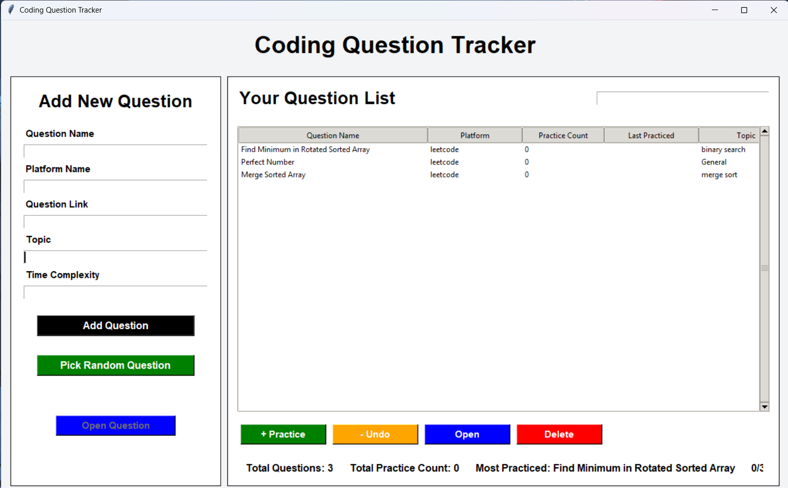

# 💻 Coding Question Tracker

A simple desktop application to **track, organize, and practice coding questions** in one place.

This project is designed to make DSA and coding interview preparation more organized by keeping a personal record of coding problems, practice frequency, topics, and progress.

---

## 📸 Screenshot

<p align="center">
  
</p>

---

## 🚀 Features

- ➕ Add new coding questions
- 📝 Store question name and platform
- 🔗 Save the question link
- 🏷️ Organize questions by topic
- ⏱️ Store time complexity
- 🔄 Track how many times a question has been practiced
- 📅 Track the last practice date
- 🎲 Pick a random coding question
- 👀 Open a selected coding question
- ↩️ Undo practice count
- 🗑️ Delete questions
- 📊 View total questions
- 📈 Track total practice count
- 🏆 See the most-practiced question
- 💾 Store question data locally

---

## 🛠️ Tech Stack

- **Python**
- **JSON** for local data storage
- **Object-Oriented Programming (OOP)**
- **GUI-based desktop interface**

---

## 📂 Project Structure

```text
Coding-Tracker/
│
├── main.py
├── coding_tracker.json
├── screenshot.png
└── README.md
